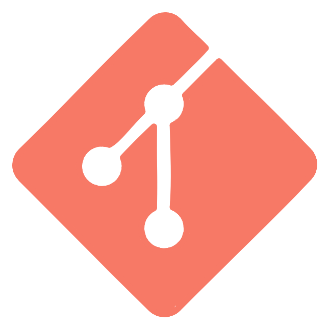
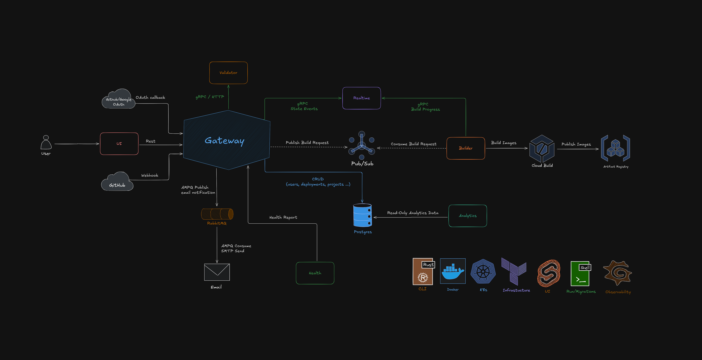

<p align="center">
  
</p>

<h1 align="center">Bifrost</h1>

<p align="center">
  Software deployment platform on GCP.
</p>

<p align="center">
  
  
  
  
  
  
</p>

---

## Table of Contents

- [Introduction](#introduction)
- [Architecture](#architecture)
- [How It Works](#how-it-works)
- [Services](#services)
  - [Communication Patterns](#communication-patterns)
  - [Why These Languages](#why-these-languages)
- [Project Structure](#project-structure)
- [GCP Infrastructure](#gcp-infrastructure)
- [Development](#development)
- [Running](#running)
  - [Local Environment](#local-environment)
  - [Run the Gateway](#run-the-gateway)
  - [Database](#database)
  - [Infrastructure](#infrastructure)
- [User Configuration](#user-configuration)
- [License](#license)

## Introduction

I came up with this project because I wanted a simple way to deploy my apps and have them instantly available. 

Bifrost is a self-service internal developer platform. A developer pushes code to GitHub, and Bifrost automatically builds a container image, deploys it to Kubernetes, assigns a URL, and monitors it. The developer sees the entire lifecycle — build logs streaming in real-time, deployment status, health checks — through a dashboard and CLI.
The system is a polyglot state machine. Every deployment follows a strict transition sequence:

```bash
queued → validating → building → built → deploying → running → healthy
```

Any state can transition to `failed`, and `failed` can retry back to `queued`. Each service in the platform is responsible for either advancing or observing specific transitions in this pipeline. Valid transitions are enforced at the data layer, making invalid state changes impossible.

## Architecture

<p align="center">
  
</p>

## How It Works

1. **GitHub sends a webhook** to the Go gateway with the repo URL, commit SHA, and branch. Alternatively, you can also send a POST request to the Gateway for adding your project and later publishing it.
2. **The gateway verifies the HMAC signature**, looks up the project, and fetches `deploy.toml` from the repo at that exact commit.
3. **The OCaml validator** parses the TOML config, type-checks all fields, and validates resource formats. Invalid configs are rejected with structured errors.
4. **The gateway creates a deployment record** (status `queued`) and publishes a build request to Pub/Sub.
5. **The Rust builder** clones the repo at the commit SHA, builds an image with Cloud Build, pushes it to Artifact Registry, and streams build logs to Elixir in real-time.
6. **The gateway receives a build-complete event**, generates Kubernetes manifests from the validated config, and applies them to GKE — including the Zig health sidecar.
7. **The Zig sidecar** starts in every pod, runs TCP health probes, reads `/proc` for CPU/memory/file descriptors, and reports metrics back to the gateway via gRPC.
8. **Elixir broadcasts** every event from steps 2–7 over WebSocket to dashboard and CLI clients.
9. **Lua scripts** embedded in the gateway handle traffic routing: rate limiting, A/B splits, header transformations — hot-reloaded from Cloud Storage without redeploying.
10. **Python analytics** run as scheduled jobs, pulling metrics from Cloud Monitoring, computing per-app costs, running anomaly detection, and writing results to BigQuery.

## Services

| Service | Language | Role |
|---------|----------|------|
| **Gateway** | Go | Central orchestrator, REST API, advances most state transitions |
| **Builder** | Rust | Builds container images, advances `building → built` |
| **Validator** | OCaml | Validates project config, guards `queued → validating` |
| **Realtime** | Elixir | Broadcasts state changes via WebSocket |
| **Healthcheck** | Zig | Sidecar that monitors running deployments |
| **Lua Scripts** | Lua | Embedded in Gateway, modifies routing behavior |
| **Analytics** | Python | Analyzes historical deployment data |
| **CLI** | Rust | Command-line interface for platform management |
| **UI** | SvelteKit | Web dashboard |

### Communication Patterns

**Synchronous (gRPC/HTTP)** — used when the caller needs an answer immediately:
- Go → OCaml: validate config before proceeding
- Go ↔ Zig: health metric streaming from sidecars
- Rust → Elixir: streaming build logs in real-time

**Asynchronous (Pub/Sub)** — used for long-running work that needs retry safety:
- Go → Rust: build requests
- Rust → Go: build complete notifications
- Go → Elixir: deployment events

**WebSocket** — push updates to clients:
- Elixir → Dashboard/CLI: real-time event stream

### Why These Languages

Each language is chosen for a specific technical advantage, not variety for its own sake:

- **Go** — stdlib HTTP/gRPC, client-go for Kubernetes, single static binary, goroutines for concurrency
- **Rust** — handles untrusted user code safely, no GC pauses during builds, deterministic resource cleanup
- **OCaml** — algebraic data types for the config AST, pattern matching for validation rules, type system prevents constructing invalid configs
- **Elixir** — BEAM handles millions of concurrent WebSocket connections at ~2KB each, OTP supervisors auto-restart crashed processes
- **Zig** — tiny static binary (< 500KB), zero runtime overhead, direct syscall access for `/proc` reading, < 5MB memory per sidecar
- **Lua** — same embedded scripting pattern as OpenResty/Nginx/Kong, sandboxable, hot-reloadable
- **Python** — pandas, BigQuery SDK, mature data ecosystem for analytics

## Project Structure

```
├── gateway/           # Go — REST API and orchestrator
├── builder/           # Rust — container image builder
├── validator/         # OCaml — project config validation
├── realtime/          # Elixir — WebSocket state broadcasts
├── healthcheck/       # Zig — deployment health sidecar
├── analytics/         # Python — deployment analytics
├── cli/               # Go — CLI tool
├── ui/                # SvelteKit — web dashboard
├── infra/             # Terraform — GCP infrastructure
├── proto/             # Protobuf service definitions
├── ops/               # Runbooks and SLO definitions
├── scripts/           # Development and deployment scripts
```

## GCP Infrastructure

| Service | Purpose |
|---------|---------|
| GKE Autopilot | Deployed apps, Rust builder, Elixir WebSocket server |
| Cloud Run | Go API, OCaml validator, Python analytics jobs |
| Pub/Sub | Async messaging with dead letter queues |
| Artifact Registry | Built container images                               |
| Cloud Storage | Build artifacts, Lua scripts, source archives |
| Cloud Build | CI/CD for Bifrost itself |
| Cloud Monitoring | Observability and alerting |

All infrastructure is defined as Terraform in `infra/`.

## Development

### Prerequisites

- [Docker](https://docs.docker.com/install/) (version 20.10+)
- [Docker Compose](https://docs.docker.com/compose/install/) (version 2.0+)
- [Go](https://golang.org/dl/) (1.25+)

## Running

To bootstrap the entire project, simply run:
```bash
make infra-apply     
make cloud-up
```

This will use Terraform to setup all the infrastructure and deploy Bifrost on GCP.

### Local Environment

```bash
make dev             # start Postgres + Pub/Sub emulator
make down            # stop local environment
make clean           # stop and delete all data
```

### Run the Gateway

```bash
make gateway-run     # run Go API on :8080
make test-api        # test all endpoints with curl
```

### Database

```bash
make migrate         # run SQL migrations
make psql            # open Postgres shell
```

### Infrastructure

```bash
make infra-apply     # Terraform apply
```

## User Configuration

Developers configure their deployments with a `deploy.toml` file in their repository:

```toml
[app]
name = "bifrost-test"
runtime = "go"

[scaling]
min_replicas = 1
max_replicas = 3
cpu_target = 70

[health]
path = "/healthz"
interval = "30s"
timeout = "5s"

[resources]
cpu = "250m"
memory = "128Mi"

[env]
LOG_LEVEL = "info"
```

The OCaml validator parses this file, type-checks every field, and returns structured errors with line numbers if anything is wrong. Valid configs are snapshotted with the deployment record so the exact configuration is always reproducible.

## License

Bifrost is open-source software licensed under the [MIT](LICENSE) license.
